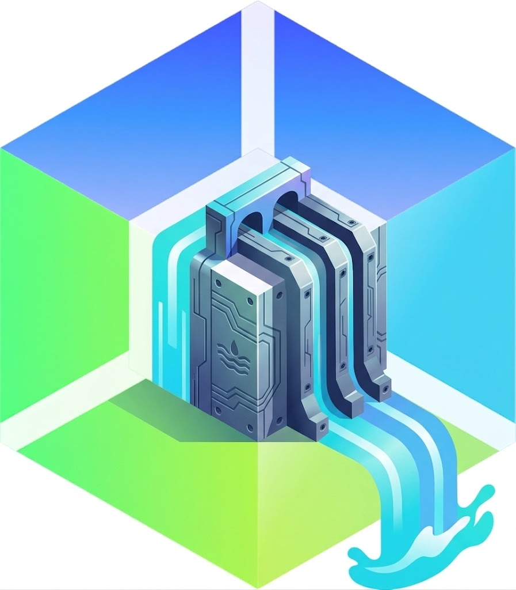

# spillway



**Serve Kubernetes API groups out of [kcp](https://kcp.io) instead of your cluster's own apiserver.**

A spillway diverts flow around a dam so the dam doesn't fail. `spillway` does the same for
your control plane: register it as an aggregated (extension) API server and the API groups it owns
are stored in and served from a kcp workspace, keeping their read and write load off
kube-apiserver and out of etcd.

New here? [docs/getting-started.md](docs/getting-started.md) walks through installing a CRD into a
kcp workspace, using it with `kubectl` against your cluster, and finding the same objects in kcp.

## Why

Custom resources are cheap until they aren't. High-churn or high-cardinality CRs share etcd and the
kube-apiserver watch cache with everything else in the cluster, so a noisy controller degrades core
workloads. Moving those groups behind an `APIService` gives them their own storage, their own
scaling envelope, and their own failure domain — while clients keep using `kubectl` and ordinary
Kubernetes clients against the same cluster endpoint.

## Status

**Working end to end.** `kubectl get widgets` against a cluster running spillway returns objects
stored in kcp, and that cluster has no CRD for them at all. The e2e suite asserts exactly this.

Spillway connects to a kcp workspace, tracks the API groups it owns there, and serves:

- discovery — `/apis`, `/apis/<group>`, `/apis/<group>/<version>`, and aggregated discovery
  (`apidiscovery.k8s.io/v2`), answered from a local cache so a slow kcp cannot fail the aggregation
  layer's availability probe. A watch on the workspace's CRDs drives the refreshes, so a CRD added
  there reaches the workload cluster in seconds rather than waiting out an interval.
- resources — every verb under `/apis/<group>/<version>/`, proxied to the workspace, including
  watch (streamed, not buffered), subresources, and kcp's own schema validation.

OpenAPI is served for the owned groups, and nothing else, so that the workload cluster's merged
spec never describes an API it does not serve.

- **v3** is proxied from the workspace's own documents and filtered to the owned group versions.
  This is what makes `kubectl explain` work.
Both documents are cached, and the cache is keyed on the resource cache's generation rather than a
timer: a change to any CRD in the workspace advances it, so the documents are rebuilt when the API
surface moves and not otherwise. Measured on a live workspace, twenty requests cost zero fetches
from kcp, and adding a CRD cost exactly one rebuild.

- **v2** is built from the workspace's CRDs. It cannot be proxied: kcp's own v2 document describes
  only its built-in types and contains no custom resource at all, so there is nothing there to
  forward. Clients new enough to use v3 never come here; the ones that do need it for
  `kubectl explain` and client-side apply.

### What does not cross the boundary

Two control planes means two of everything, and some of it does not join up.

**ownerReferences must stay inside the workspace.** kcp runs its own garbage
collector, and an `ownerReference` naming something the workspace does not contain looks to it
exactly like an owner that has already been deleted — measured against a real kcp, the object was
collected in under five seconds, with no event and no trace. Such a reference is therefore
**refused at write time** with an error saying why, rather than accepted and quietly destroyed.

Bridging it instead of refusing it would mean hiding those references from kcp and restoring them
on the way out, which turns every read — including every watch frame — into a decode and
re-encode. That is a different design from the pass-through proxy this is, so it is a decision
rather than a patch. It needs no shadow copies either way.

**Admission webhooks fire on create, update and delete.** A `ValidatingWebhookConfiguration` in the
workload cluster is consumed by *its* apiserver's admission chain, which an aggregated API never
passes through — so these webhooks used to be silently skipped for offloaded resources. Spillway
now runs the admission chain itself. It is built on `k8s.io/apiserver`, and that chain is
constructed against the workload cluster's client, so it reads the same webhook configurations and
dials the same webhook services. Nothing is copied into the cluster: a webhook is called with an
`AdmissionReview`, and the object never has to exist there.

Update and delete fetch the current object from kcp first, so a webhook sees a real `oldObject`
rather than an empty one. Mutating webhooks are honoured on create and update.

`PATCH` is dispatched too, by a different route. kube-apiserver applies a patch and then admits the
result, so a webhook must see the object the patch produces. Spillway cannot resolve a patch
itself — a JSON patch, a merge patch and a server-side apply each resolve differently, and apply
depends on field ownership only kcp holds — so it asks kcp with a dry run and admits that answer.
If admission leaves it alone the original patch is forwarded, keeping kcp's atomicity and conflict
behaviour intact; only when a mutating webhook actually changes something does the request become a
write of the admitted object, guarded by the `resourceVersion` it came from.

Patch dispatch is covered end to end: the suite registers a webhook and asserts that a patch is
refused by it, alongside create.

**Spillway will not register over a group your cluster already serves.** An `APIService` takes
precedence over everything behind it, so pointing one at spillway for a group the cluster serves
from its own CRDs takes that group away from it. Measured on a live cluster, the damage outlives the
mistake: kube-apiserver reverted the hijacked `APIService` to `Local` in **159ms**, and yet the
group's entry in aggregated discovery — the document `kubectl` prefers — was left with an **empty
resource list marked `Current`**, which did not repopulate when the `APIService` was restored, when
the CRD was touched, or after a minute of waiting. Legacy discovery was correct throughout and the
objects never left etcd; they were simply invisible to any client that asks the way kubectl asks.

Spillway therefore reads what the cluster serves before registering anything, and skips any group
version routed by an `APIService` that is not its own — `Local` ones included, since that is what
every CRD group has. If it cannot find out, it registers nothing: a wrong yes hides another API
silently, a wrong no leaves a group unserved and says so. This matters most with a wildcard, which
can cover a group the cluster is already using without anyone intending it.

**A webhook may be shown another version only where the workspace says the versions are the same.**
A webhook registered with `matchPolicy: Equivalent` — the default — is shown the object in the
version its rule names, whoever converts it. Where the workspace's definition declares
`strategy: None`, its versions are structurally identical and the conversion is the relabel, which
is what kube-apiserver's own converter does for those. Where a conversion webhook owns it, spillway
refuses: kcp dials that webhook and spillway cannot, and handing a policy webhook an object labelled
`v1` but shaped like `v1alpha1` would have it evaluate the wrong object and say yes.

**An `APIExport`'s virtual endpoint serves cross-workspace list and watch, and nothing else.**
Spillway can be pointed at one, and then a cluster sees every bound workspace's objects through a
single group. kcp refuses a namespaced list or a get by name against such an endpoint, though — it
spans workspaces, so a request scoped to one namespace of one of them is not a question it can
answer. Those refusals come from kcp, unchanged, through spillway.

**ResourceQuota does not count offloaded objects.** A quota is enforced by the cluster's own quota
controller, which counts what that cluster stores. Offloaded objects are not in its etcd and never
appear in its resource counts, so `count/widgets.example.com` stays at zero however many exist. This
is not something spillway can bridge: honouring a quota would mean spillway tracking usage per
namespace and refusing writes itself, which is a second, divergent implementation of a controller
the cluster already has. Note it before offloading a resource whose growth you were relying on a
quota to bound — kcp's own limits are where that ceiling has to come from instead.

The same applies to anything else computed from the cluster's storage: `kubectl api-resources`
shows the group, but the object counts, the storage-size metrics and the etcd alarms all describe a
store the objects are not in. That is, after all, the point.

### Who spillway is when it talks to kcp

Callers are authenticated and authorized against the **workload cluster** before a request is
proxied — the generic handler chain runs a `TokenReview` and a `SubjectAccessReview` against it. By
default the request then reaches kcp as spillway itself, so the workload cluster's RBAC is the only
authorization check and the workspace's own RBAC is not consulted.

`--kcp-impersonate-users` forwards the caller's identity instead, so the workspace's RBAC applies
as a second gate. It requires spillway's kcp identity to hold impersonate permissions and the
workspace to carry RBAC covering the workload cluster's users.

## How it works

```
kubectl ──▶ kube-apiserver ──▶ APIService (aggregation layer)
                                    │
                                    ▼
                              spillway ──▶ kcp workspace
                                                (storage + watch)
```

1. An `APIService` object hands a group/version to spillway instead of to the built-in CRD handler.
2. kube-apiserver proxies matching requests to spillway over TLS, forwarding the authenticated
   user via the aggregation layer's request headers.
3. Spillway delegates authentication and authorization back to kube-apiserver
   (`TokenReview`/`SubjectAccessReview`), so existing RBAC keeps working unchanged.
4. Requests are served from the configured kcp workspace, which owns the storage.

Spillway serves from **one workspace or several**. `--kcp-kubeconfig` and `--api-group` describe
one; `--workspaces-file` describes any number, because the pairing of a kubeconfig with the groups
it backs cannot be expressed by repeating flags — the third `--kcp-kubeconfig` would belong to the
third `--api-group` only by position:

```yaml
workspaces:
  - name: team-a
    kubeconfig: /etc/spillway/team-a.kubeconfig
    apiGroups: ["*.team-a.example.com"]
  - name: team-b
    kubeconfig: /etc/spillway/team-b.kubeconfig
    apiGroups: ["widgets.example.com"]
```

`config/multi-workspace.yaml` is that shape as manifests — the Secret of kubeconfigs, the ConfigMap,
and the patch that points the Deployment at them.

A workspace can also override the flags for itself — `impersonateUsers`, `requestTimeout`,
`retries`, `failureThreshold`, `circuitCooldown` — because one kcp being slow is a fact about that
kcp rather than about the others.

The file is re-read while spillway serves, so a workspace can be added, removed or repointed without
the restart that would drop every watch being proxied from the workspaces that did not change.
Mount it as a directory rather than with `subPath`: a `subPath` mount is never updated when the
ConfigMap changes, so the file inside the pod would stay as it was.

A group comes from exactly one workspace. Two workspaces naming one group outright is refused at
startup — there is a single `APIService` for a group, pointing at a single spillway, which has to
know which workspace to ask — and where wildcards overlap, the first workspace listed wins.

`--api-group` takes a domain wildcard as well as an exact name: `--api-group='*.example.com'` serves
every group under that domain the workspace has now or gains later, so a CRD in a *new group* is
picked up by the same watch that already notices one in a new version. A wildcard has to name at
least a two-label domain and may not cover `*.k8s.io` — an `APIService` in front of `apps` or `rbac`
is not a mistake you recover from quickly.

With `--register-apiservices`, step 1 is spillway's own doing: it maintains an `APIService` for every
group version the workspace serves, adding one when the workspace starts serving a version and
withdrawing it when the workspace stops. It only ever touches registrations it created — an
`APIService` you declared is left as written, since a version that fails the availability probe
degrades discovery for the whole cluster and that is not a decision to make on your behalf.

Spillway holds no state of its own — the etcd options of the generic apiserver are deliberately
disabled.

### When kcp is unwell

Requests to kcp are bounded and, past a point, refused. A read that fails at the connection level is
retried; anything that changes state is not, since replaying a create would risk making the object
twice. After enough consecutive failures the circuit opens and requests fail immediately rather than
queueing against a backend that is not answering — which is what turns a slow kcp into an
unavailable `APIService`. One request is let through after the cooldown to decide whether to close
it again.

A 5xx from kcp counts against the backend; a 4xx does not, because that is the caller's request
being wrong rather than kcp being unwell.

## Building

```console
make build          # -> bin/spillway
make verify         # fmt, vet, test
make image          # local snapshot image, via goreleaser
make snapshot       # full snapshot: binaries, archives, checksums, image
```

There is one build path: goreleaser (`.goreleaser.yaml`), which drives [ko](https://ko.build) for
the image side. No Dockerfile, no separate ko config. `make image` produces a local snapshot image
in the docker daemon as `goreleaser.ko.local:<version>`; the e2e harness uses the same path.

goreleaser derives the version from git, so **the repository needs at least one commit** before any
image can be built.

## Releases

Pushing a `v*` tag runs `.github/workflows/release.yml`, which builds, signs, and publishes.

Only official releases reach `ghcr.io/mrueg/spillway`. goreleaser substitutes `goreleaser.ko.local`
for the configured repository whenever it builds a snapshot, so a local or CI-preview build cannot
produce a ghcr-named image even by misconfiguration.

| Artifact | Protection |
| --- | --- |
| `checksums.txt` | cosign keyless signature, `checksums.txt.bundle`. It lists every archive's hash, so one signature covers them all. |
| Release archives | syft SBOM alongside each archive |
| Container image | SBOM attached by ko; the published image is signed by digest with cosign |
| Archives + checksums | GitHub build provenance attestation |

Verification is keyless — no public key to distribute:

```console
cosign verify-blob checksums.txt \
  --bundle checksums.txt.bundle \
  --certificate-identity-regexp '^https://github.com/mrueg/spillway/' \
  --certificate-oidc-issuer https://token.actions.githubusercontent.com

cosign verify ghcr.io/mrueg/spillway:<tag> \
  --certificate-identity-regexp '^https://github.com/mrueg/spillway/' \
  --certificate-oidc-issuer https://token.actions.githubusercontent.com
```

Signing and SBOM generation need cosign and syft, and keyless signing blocks on an interactive
Sigstore flow outside CI — goreleaser runs both pipes for snapshots too, so `make image` and
`make snapshot` skip them. Neither tool is needed for local development.

## Deploying

`config/spillway.yaml` carries everything needed: ServiceAccount, the `system:auth-delegator`
binding and `extension-apiserver-authentication-reader` rolebinding, a ClusterRole for the shared
informers, Deployment, Service, and the `APIService`. Substitute `${SPILLWAY_IMAGE}` and
`${SPILLWAY_GROUP}`, and supply the kcp credentials in a secret:

```console
kubectl -n spillway-system create secret generic spillway-kcp-kubeconfig \
  --from-file=kubeconfig=/path/to/workspace.kubeconfig
```

The manifest sets `insecureSkipTLSVerify` on the `APIService` because spillway generates a
self-signed serving certificate at startup. Production deployments should supply a real certificate
and set `caBundle` instead.

## Benchmark

`test/bench` runs the same workload against an ordinary CRD and against the same resource offloaded
to kcp, through the same cluster endpoint:

```console
make e2e-up && make bench && make e2e-down
```

Spillway is slower and has to be — one hop becomes three. What that buys is in
[docs/benchmark.md](docs/benchmark.md) along with the numbers: 400 native objects appear in the
cluster's own storage metric, and the 400 offloaded ones never appear at all.

## End-to-end tests

`hack/e2e.sh` provisions a kind cluster (the workload cluster) next to a kcp control plane, seeds a
workspace with a CRD and custom resources, and runs the assertions in `test/e2e`:

```console
make e2e            # provision, then test
make e2e-up         # provision only
make e2e-test       # re-run the assertions against a live environment
make e2e-down       # tear down
```

kcp runs as a container on kind's docker network. It detects that address at startup, writes it into
the kubeconfig it generates, and lists it in the SANs of its serving certificate — so one kubeconfig
works unmodified from the host and from inside the cluster. The suite asserts that property rather
than assuming it, since a deployed spillway depends on it.

The harness builds the image with goreleaser, loads it into the cluster, deploys spillway, and
registers the `APIService`, so the suite exercises the real aggregation path rather than talking to
spillway directly. What it covers:

| Test | Asserts |
| --- | --- |
| `TestWorkspaceServesWidgetAPI` | The offloaded group is discoverable in the kcp workspace |
| `TestWidgetCRDIsEstablished` | The CRD reached `Established` inside kcp |
| `TestSeededWidgetsAreStoredInKCP` | CRs read back correctly, including schema defaulting |
| `TestWidgetRoundTrip` | Create, update, schema validation, and delete directly against kcp |
| `TestWidgetCRDIsAbsentFromWorkloadCluster` | No CRD in the workload cluster: the storage really is elsewhere |
| `TestAPIServiceIsAvailable` | The aggregation layer accepted spillway |
| `TestPodsCanReachKCP` | A pod can open a TLS connection to kcp |
| `TestWidgetsThroughAggregationLayer` | **The payoff.** Reads and writes through the cluster land in kcp, and kcp's validation still applies |
| `TestWatchThroughAggregationLayer` | Watch events stream through the proxy rather than arriving in a lump |
| `TestOwnerOutsideTheWorkspaceIsRefused` | An owner kcp cannot see is rejected, not silently collected |
| `TestOwnerInsideTheWorkspaceIsAccepted` | Ownership within the workspace still works normally |
| `TestValidatingWebhookIsCalled` | A webhook in the cluster is invoked for an offloaded create *and* patch, and `failurePolicy` is honoured |
| `TestNewCRDAppearsThroughAggregationLayer` | A CRD added to the workspace reaches the cluster in seconds, which only holds if discovery is watch-driven |

Requires Linux with native docker: the harness reaches kcp over the docker bridge, which is not
routable from the host under Docker Desktop.

## Running

Spillway needs a kubeconfig for the kcp workspace that backs the offloaded APIs, the groups it
should serve, plus the usual aggregated-apiserver credentials for talking back to the host cluster:

```console
bin/spillway \
  --kcp-kubeconfig=$HOME/.kcp/workspace.kubeconfig \
  --api-group=widgets.example.com \
  --api-group='*.tenant.example.com' \
  --kubeconfig=$HOME/.kube/config \
  --authentication-kubeconfig=$HOME/.kube/config \
  --authorization-kubeconfig=$HOME/.kube/config \
  --secure-port=6443
```

| Flag | Purpose |
| --- | --- |
| `--workspaces-file` | Path to a YAML file listing several kcp workspaces and the groups each one backs, for serving from more than one. Mutually exclusive with the two flags below, which are the single-workspace form of the same thing. |
| `--kcp-kubeconfig` | Credentials for kcp. **Its server URL must address the workspace**, e.g. `https://kcp:6443/clusters/root:myworkspace` — the workspace is selected by URL path, not by a separate flag. |
| `--api-group` | A group to serve from that workspace, or a domain wildcard such as `*.example.com` for every group under it the workspace has or gains, or an exclusion such as `!internal.example.com` that narrows one. Every version of a matched group is exposed. Repeat for more. At least one is required. A wildcard must name at least a two-label domain and may not cover `*.k8s.io`; an exclusion has no such rules, since serving less than was meant is visible immediately. |
| `--leader-elect` | Have one replica maintain the registered `APIService`s rather than all of them (default on). Serving needs no leader and is unaffected; this is about who writes. Ignored without `--register-apiservices`. The Lease is named by `--leader-elect-resource-name`, in `--leader-elect-resource-namespace`, with the usual duration, deadline and retry-period flags. |
| `--register-apiservices` | Create and maintain an `APIService` for every group version the workspaces serve, rather than declaring them by hand. Only registrations spillway created are updated or withdrawn, and never one for a group the cluster already serves itself. |
| `--apiservice-service-name` / `--apiservice-service-namespace` / `--apiservice-service-port` | Where the aggregation layer should reach spillway. The namespace defaults to the one spillway is running in. |
| `--apiservice-ca-bundle-file` | PEM bundle of the authority that signed spillway's serving certificate, re-read on every refresh so a rotation is picked up. |
| `--apiservice-insecure-skip-tls-verify` | Register `APIService`s that do not verify spillway's certificate. What a self-signed startup certificate needs, and not something to run in production. Mutually exclusive with the CA bundle. |
| `--apiservice-group-priority-minimum` / `--apiservice-version-priority` | Priorities for the registered `APIService`s. |
| `--authorization-qps` / `--authorization-burst` | How fast spillway may send `SubjectAccessReview`s to the cluster (default 800/1600). One is sent per request whose subject, verb, resource and object name the authorizer has not cached, so throughput on distinct objects is capped by this — the generic apiserver fixes it at 200 with no flag, which is a ceiling rather than a default for something carrying a cluster's load. |
| `--max-requests-inflight` | Concurrent non-mutating requests before shedding load with a 429 (default 400). Watches are exempt. Zero means no limit. |
| `--max-mutating-requests-inflight` | The same, for requests that change state (default 200). |
| `--kcp-resync-period` | Backstop interval for re-examining the workspace regardless of any change (default 10m). Changes normally arrive on a watch; this covers what a watch cannot report. |
| `--mirror-namespaces` | Create a namespace in the workspace the first time an object is written into it, instead of requiring it in both places (default off). Only namespaces that are used are created, they are labelled as spillway's, and none is ever deleted. What it has seen is remembered for ten minutes, so a namespace removed from the workspace is noticed rather than believed in until restart. |
| `--kcp-credential-reload-period` | How often to re-read each workspace's kubeconfig and, when one is used, the workspaces file, so a rotated token or an added workspace is picked up without a restart (default 1m). Zero disables it. |
| `--kcp-impersonate-users` | Forward the caller's identity to kcp so the workspace's RBAC applies too (default off). |
| `--kcp-request-timeout` | How long to wait for kcp to answer a proxied request (default 30s). Watches are exempt from the deadline, but not from the wait for their first response header. |
| `--kcp-retries` | Retries for a read after a connection-level failure (default 2). Requests that change state are never retried. |
| `--kcp-failure-threshold` | Consecutive kcp failures before the circuit opens (default 5). |
| `--kcp-circuit-cooldown` | How long the circuit stays open before one request is let through to test kcp (default 10s). |
| `--kubeconfig` | Host cluster access for the shared informers. Implicit when running in-cluster. |

## Health and metrics

Liveness and readiness answer one question — can spillway serve at all — and deliberately say
nothing about whether kcp offers a particular group. A group the workspace does not serve would
otherwise fail the probes, pull the pod from its Service endpoints, and take down every *other*
group with it.

| Endpoint | Meaning |
| --- | --- |
| `/livez` | The process is up. Never affected by kcp. |
| `/readyz` | Discovery has synced at least once (`kcp-discovery-synced`). |
| `/healthz/groups` | Aggregate: fails if any configured group is missing from the workspace. |
| `/healthz/groups/<group>` | One group, with the reason in the body. |

The group endpoints skip authorization, as the standard health endpoints do — a probe, or an
operator debugging an `APIService`, has no credentials to offer. `/metrics` does require them.

A refresh that fails after the first success is logged and the previous snapshot keeps being
served — a brief kcp outage should not flip the `APIService` and degrade discovery cluster-wide.
That makes staleness invisible from the API alone, so it is measured instead:

| Metric | Use |
| --- | --- |
| `spillway_kcp_discovery_last_success_timestamp_seconds` | Age of this value is how stale discovery may be. |
| `spillway_kcp_discovery_refresh_total{result}` | Success/error refresh counts. |
| `spillway_kcp_discovery_refresh_duration_seconds` | Refresh latency. |
| `spillway_kcp_group_served{group}` | `1` if the workspace serves a configured group, `0` if not. |
| `spillway_proxy_requests_total{verb,resource,code}` | Everything asked of kcp and what it answered, resource requests and OpenAPI fetches alike (`resource="openapi"`). |
| `spillway_proxy_duration_seconds{verb,resource}` | Time to kcp's response headers — not to stream the body, or a watch would record its whole lifetime. |
| `spillway_proxy_errors_total{reason,verb,resource}` | Requests that got no answer: `connection`, `timeout`, `canceled`, `circuit_open`. |
| `spillway_proxy_retries_total` | Retried reads. A rising rate means kcp is flapping even while clients see no errors. |
| `spillway_kcp_circuit_state{state}` | `1` for the breaker's current state. |

The generic `apiserver_request_*` metrics already count these requests as spillway served them; the
`spillway_proxy_*` ones measure the hop to kcp, which is what tells a slow kcp from a slow spillway.

`spillway_kcp_group_served` is what distinguishes "kcp is unreachable" (refreshes failing, timestamp
going stale) from "the workspace genuinely dropped that group" (refreshes succeeding, gauge at `0`).

## Layout

| Path | Contents |
| --- | --- |
| `cmd/spillway` | Binary entrypoint |
| `pkg/cmd/server` | Flags, validation, and server startup |
| `pkg/apiserver` | Generic apiserver wiring and the served API surface |
| `pkg/kcp` | Client plumbing for the backing kcp workspace |

## License

Apache 2.0 — see [LICENSE](LICENSE).
